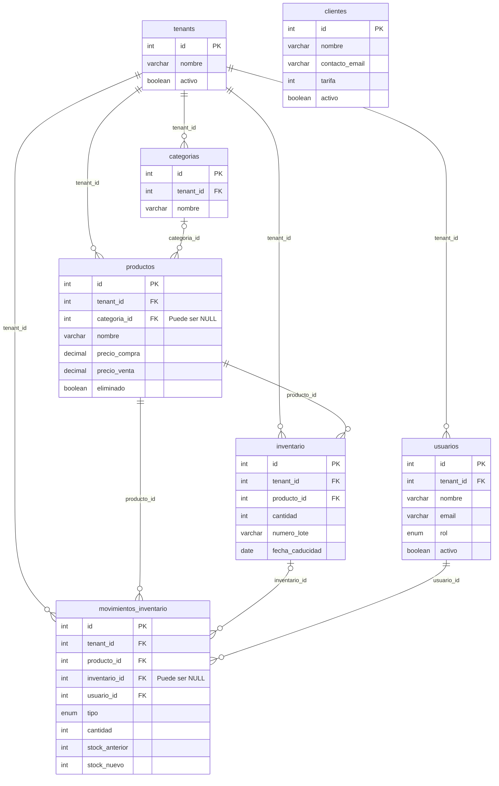
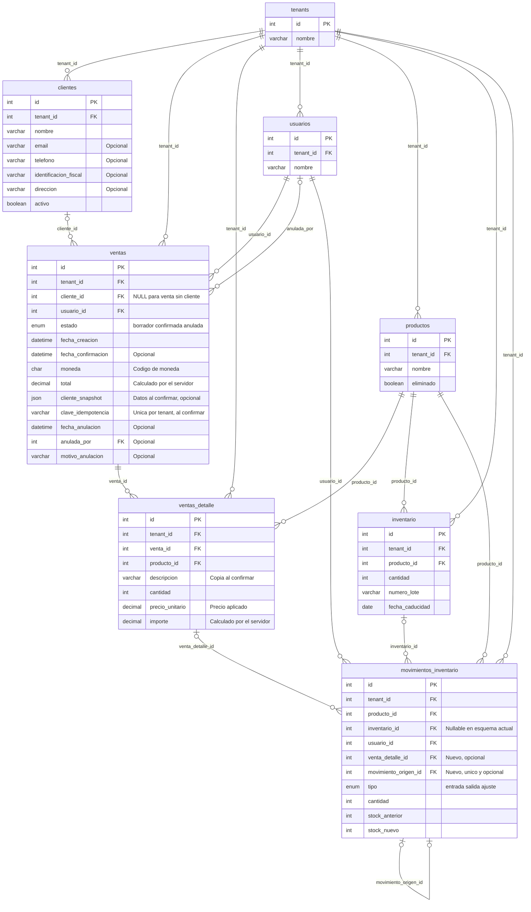

# Brétema: relaciones de la base de datos

PK = clave primaria. FK = clave foránea: referencia al ID de otra tabla.
Se muestran los identificadores y algunos campos de contexto, no todas las columnas.

Fuente: `back/tests/fixtures/schema.sql` para el núcleo y
`documentation/Database/describedatabase.txt` para la tabla `clientes`.
Este diagrama representa el esquema del repositorio; no se ha consultado la base desplegada.

## Referencias exactas

| Clave foránea | Referencia | Permite NULL | Al borrar la fila referenciada |
| --- | --- | --- | --- |
| usuarios.tenant_id | tenants.id | No | CASCADE |
| categorias.tenant_id | tenants.id | No | Restricción |
| productos.tenant_id | tenants.id | No | CASCADE |
| productos.categoria_id | categorias.id | Sí | SET NULL |
| inventario.tenant_id | tenants.id | No | CASCADE |
| inventario.producto_id | productos.id | No | CASCADE |
| movimientos_inventario.tenant_id | tenants.id | No | Restricción |
| movimientos_inventario.producto_id | productos.id | No | Restricción |
| movimientos_inventario.inventario_id | inventario.id | Sí | Restricción |
| movimientos_inventario.usuario_id | usuarios.id | No | Restricción |

Una empresa puede tener muchos usuarios, categorías, productos, lotes y movimientos.
Un producto puede tener muchos lotes y movimientos. Cada movimiento identifica
al usuario que lo registró y puede identificar un lote.

`||` significa exactamente uno; `o{`, cero o muchos; `|o`, cero o uno.
Las acciones de borrado son restricciones de MySQL. La aplicación utiliza borrado
lógico de productos; otras claves foráneas pueden impedir un borrado físico incluso
cuando una relación concreta tenga CASCADE.

## Límites del esquema documentado

- `clientes` figura en la documentación histórica, pero no en la fixture actual de
  pruebas. Allí no tiene `tenant_id` ni relaciones declaradas. Su existencia y
  estructura actuales en la base desplegada requieren confirmación.
- No hay tablas de ventas ni líneas de venta en estas fuentes. La venta rápida
  actual registra movimientos de salida.
- Las FK son simples: comprueban que el ID referenciado exista, pero no garantizan
  por sí solas que producto, lote, usuario y movimiento pertenezcan al mismo tenant.
  El backend debe comprobar esa pertenencia.

## Propuesta: clientes y ventas

Diseño para la siguiente fase, todavía no implementado. Este apartado no modifica
la base de datos. Mantiene el motor de inventario y añade una cabecera de venta,
sus líneas y la relación de estas con los movimientos. Se omiten categorías y
otras columnas del diagrama anterior para facilitar la lectura.

### Cómo se relacionan

| Referencia nueva | Para qué sirve |
| --- | --- |
| clientes.tenant_id → tenants.id | Cada cliente comercial pertenece a una empresa. |
| ventas.tenant_id → tenants.id | Cada venta pertenece a una empresa. |
| ventas.cliente_id → clientes.id | Identifica al comprador; permite ventas sin cliente registrado. |
| ventas.usuario_id → usuarios.id | Identifica a quien registra la venta. |
| ventas.anulada_por → usuarios.id | Identifica a quien anula la venta. |
| ventas_detalle.tenant_id → tenants.id | Permite filtrar y restringir las líneas por empresa. |
| ventas_detalle.venta_id → ventas.id | Agrupa los productos de una venta. |
| ventas_detalle.producto_id → productos.id | Identifica el producto vendido en cada línea. |
| movimientos_inventario.venta_detalle_id → ventas_detalle.id | Relaciona cada descuento o reposición de stock con una línea de venta. |
| movimientos_inventario.movimiento_origen_id → movimientos_inventario.id | Relaciona una reposición por anulación total con la salida original. |

Una venta puede tener varias líneas y cada línea puede consumir varios lotes.
Por eso el lote se vincula a través de los movimientos, no mediante un único
`inventario_id` en `ventas_detalle`. Los movimientos manuales mantienen
`venta_detalle_id = NULL`.

Ejemplo: una venta de 5 unidades de un producto genera una línea de cantidad 5.
Si consume 3 unidades del lote A y 2 del lote B, genera dos movimientos de salida,
ambos asociados al mismo `venta_detalle_id`, cada uno con su propio `inventario_id`.

### Reglas que debe acompañar la implementación

1. Un borrador puede tener cero líneas y no modifica stock. Una venta confirmada
   debe tener al menos una línea, cantidades positivas y productos de su empresa.
2. Confirmar debe guardar venta, líneas definitivas, descuento de lotes y movimientos
   en una sola transacción. La selección de lotes conserva el orden por caducidad
   del motor existente. Los movimientos de venta deben identificar siempre el lote.
3. `UNIQUE (tenant_id, clave_idempotencia)` debe impedir dos confirmaciones para la
   misma operación. El servidor debe devolver la venta existente ante un reintento
   equivalente y rechazar una reutilización con datos distintos. La transición de
   borrador a confirmada también debe bloquearse para impedir descuentos repetidos
   aunque lleguen claves diferentes para la misma venta.
4. Descripción, precio y datos del cliente se copian al confirmar para conservar el
   histórico. Cambiar posteriormente el producto o cliente no reescribe la venta.
   Los importes se calculan con aritmética decimal y se almacenan como DECIMAL,
   con precisión, moneda y redondeo acordados antes de implementar.
5. Una venta confirmada no se edita ni se borra físicamente. La propuesta inicial
   admite anulación total: se bloquea la venta, se generan entradas compensatorias
   en los lotes originales y se marca anulada en una única transacción. Cada entrada
   apunta a la salida que compensa mediante `movimiento_origen_id`, con unicidad
   para impedir compensarla dos veces. Se conserva el mismo detalle y producto.
   Si el lote ya caducó, la reposición aumenta stock físico, no stock disponible.
6. Clientes se desactivan y productos conservan su borrado lógico. Las nuevas FK
   deben restringir el borrado físico de registros con histórico, sin cascadas
   que eliminen ventas confirmadas o sus líneas.
7. Los enlaces dibujados representan las relaciones lógicas. En SQL se proponen
   claves compuestas `(tenant_id, id)` únicas en las tablas referenciadas y FK
   compuestas `(tenant_id, cliente_id)`, `(tenant_id, venta_id)`, etc., para impedir
   referencias entre empresas. También debe validarse que el producto de cada
   movimiento coincida con el de su línea y lote, y que una compensación corresponda
   a la salida original. Una FK simple sobre el ID no basta para estas reglas.

### Decisiones antes de migrar

- La tabla histórica `clientes` tiene estructura parecida a `tenants` y carece de
  `tenant_id`. Hay que inspeccionar sus datos y su uso antes de reutilizarla: no se
  deben convertir automáticamente esos registros en compradores ni asignarles una
  empresa arbitraria. El diagrama muestra la estructura comercial propuesta.
- Acordar campos de cliente y política de conservación de datos históricos.
- Acordar moneda, impuestos, descuentos y redondeo. El diagrama no representa aún
  un modelo de facturación fiscal, cobros o pagos.
- La anulación total propuesta no cubre devoluciones parciales. Estas requerirían
  su propio modelo y límites sobre cantidades ya devueltas.
- Adaptar la venta rápida para que use el mismo flujo comercial de confirmación
  cuando entre en servicio este módulo. Los movimientos anteriores pueden seguir
  sin venta asociada; no deben inventarse ventas históricas a partir de ellos.
